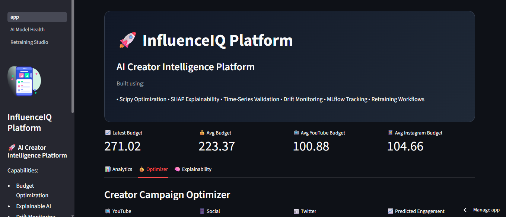
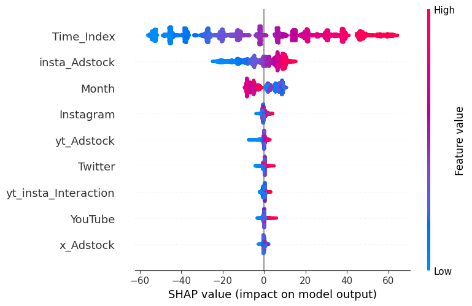
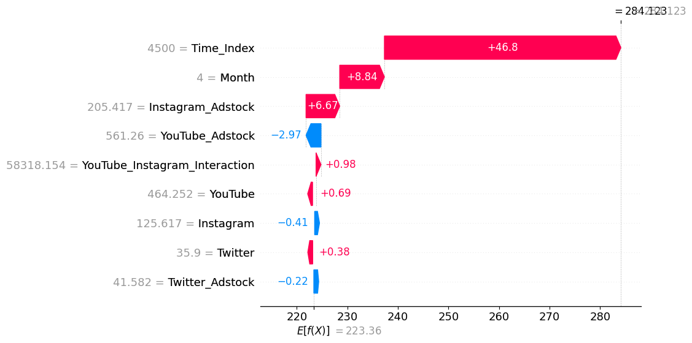

# 🚀 InfluenceIQ Engine

## AI-Powered Influencer Campaign Intelligence Platform

InfluenceIQ Engine is a production-oriented machine learning platform that helps brands optimize creator marketing budgets across TikTok, Instagram, and YouTube using:

- 📈 Budget Optimization
- 🧠 Explainable AI
- ⚠️ Drift Monitoring
- 🔄 Retraining Workflows
- 📊 Time-Series Validation
- 🧪 ML Experiment Tracking

---

# 🌐 Live Demo

👉 [Launch App](https://influenceiq-engine.streamlit.app/)

---

# 📸 Product Preview

## Dashboard



---

## SHAP Explainability



---

## Waterfall Explanation



---

# 🧠 Problem Statement

Modern influencer marketing campaigns often suffer from:

- inefficient budget allocation
- unclear ROI attribution
- platform saturation
- changing audience behavior
- lack of explainability

InfluenceIQ Engine solves this by combining:

✅ optimization  
✅ explainable AI  
✅ scenario simulation  
✅ model monitoring  
✅ retraining pipelines  

into a unified ML platform.

---

# 🚀 Core Features

## 💰 Creator Campaign Optimizer

Users provide a campaign budget and the system determines the optimal allocation across:

- TikTok
- Instagram
- YouTube

using:

- Scipy constrained optimization
- diminishing return modeling
- budget caps
- marginal ROI analysis

---

## 🧠 Explainable AI

The platform uses SHAP to explain:

- why predictions changed
- which platform contributes most
- feature-level impact
- creator niche influence

Includes:

- SHAP Summary Plots
- Waterfall Analysis
- Feature Contribution Visualization

---

## ⚠️ Drift Monitoring

Built-in monitoring system detects:

- concept drift
- distribution shifts
- rising residual errors
- unstable prediction regions

Includes:

- rolling MAE analysis
- residual tracking
- feature distribution monitoring
- outlier validation

---

## 🔄 Retraining Workflow

The app supports:

- CSV upload
- schema validation
- automated retraining
- before-vs-after metric comparison
- model replacement

---

## 📊 Time-Series ML Validation

Instead of naive random splits, the system uses:

```python
TimeSeriesSplit
```

to avoid:
- temporal leakage
- unrealistic validation
- future information contamination

---

# 🏗️ System Architecture

```plaintext
User Input
    ↓
Scenario Simulation
    ↓
Feature Engineering
    ↓
ML Pipeline
    ↓
Optimization Engine
    ↓
SHAP Explainability
    ↓
Drift Monitoring
```

---

# 🧩 Tech Stack

## Machine Learning

- Scikit-learn
- XGBoost
- SHAP
- Scipy
- MLflow

---

## Data Engineering

- Pandas
- NumPy
- Faker

---

## Visualization

- Streamlit
- Plotly
- Matplotlib

---

## MLOps

- Docker
- GitHub Actions
- Pytest

---

# 📂 Project Structure

```plaintext
InfluenceIQ-Engine/
│
├── app/
│   ├── app.py
│   └── pages/
│       ├── 1_Model_Health.py
│       └── 2_Retrain_Model.py
│
├── data/
├── models/
├── reports/
├── src/
├── tests/
├── .github/
├── Dockerfile
├── requirements.txt
└── README.md
```

---

# ⚙️ Installation

## Clone Repository

```bash
git clone YOUR_REPO_LINK
cd InfluenceIQ-Engine
```

---

## Create Environment

```bash
python -m venv venv
```

---

## Activate Environment

### Windows

```bash
venv\\Scripts\\activate
```

### Mac/Linux

```bash
source venv/bin/activate
```

---

## Install Dependencies

```bash
pip install -r requirements.txt
```

---

# 🚀 Run Application

```bash
streamlit run app/app.py
```

---

# 🐳 Docker Setup

## Build Image

```bash
docker build -t influenceiq-engine .
```

---

## Run Container

```bash
docker run -p 8501:8501 influenceiq-engine
```

---

# ⚙️ CI/CD

GitHub Actions automatically:

✅ installs dependencies  
✅ runs pytest suite  
✅ validates optimization logic  

on every push and pull request.

---

# 🧪 Testing

Run locally:

```bash
pytest
```

Expected:

```plaintext
3 passed
```

---

# 📈 Model Performance

| Model | R² Score |
|---|---|
| Ridge Regression | ~0.80 |
| XGBoost | ~0.27 |

---

# 🧠 Engineering Highlights

## Advanced ML Concepts

- Time-Series Cross Validation
- Residual Analysis
- Drift Detection
- Explainable AI
- Constrained Optimization
- Feature Engineering
- Adstock Modeling
- Saturation Curves

---

## Product Thinking

- Scenario Simulation
- Creator Niche Intelligence
- Competitor Benchmarking
- Interactive Budget Planning

---

# 🔮 Future Improvements

- FastAPI backend
- PostgreSQL logging
- Real-time streaming inference
- Kubernetes deployment
- Evidently AI monitoring
- Authentication layer

---

# 👨‍💻 Author

Sarowar Ahmed

---

# ⭐ If you found this project interesting

Please consider starring the repository.